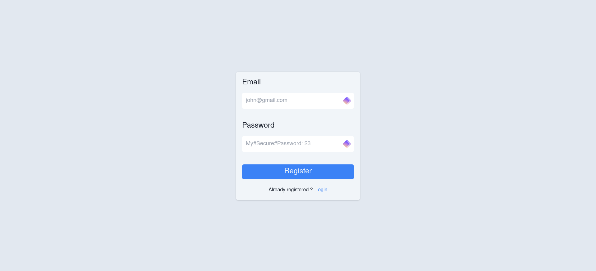
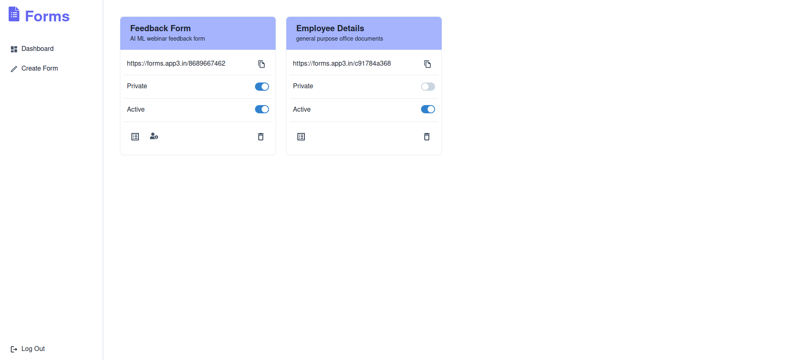
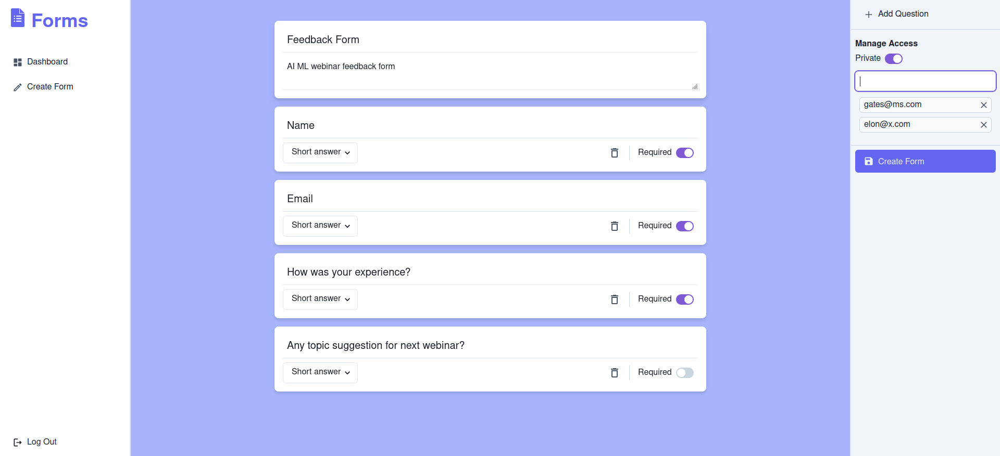
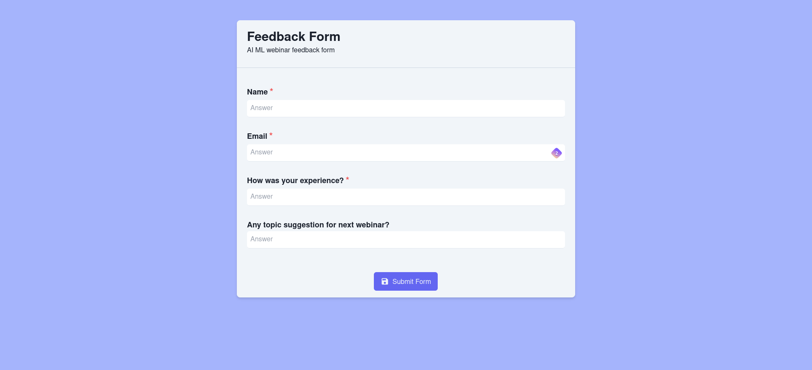

# Forms - Google Forms Clone
A web application that allows users to create, distribute, and manage forms similar to Google Forms.

## [Demo](https://forms-app3.vercel.app/)

## Features
- User authentication (register, login, JWT validation).
- Create forms with various input types (input field, file upload).
- Share forms via unique links.
- Toggle form submission active status.
- Edit list of allowed users for private forms.
- Public and private form visibility settings.
- Table representation of form responses.

## Tech Stack
- Backend: Node.js, Express.js, JWT, bcrypt
- Frontend: React.js, React Router, Tailwind CSS, Chakra UI
- Database: Supabase (PostgreSQL), GoFiles(file storage)

## How to Setup Locally
1. Clone the repository.
    ```
    https://github.com/akashvaghela09/forms.git
    ```
2. Navigate to the project directory and install the dependencies.
    ```
    cd forms/backend && npm install
    ```
3. Rename `sample.env` to `.env` and fill in the required environment variables.
4. Start the backend server.
    ```
    npm start
    ```
5. Navigate to the frontend directory and install the dependencies.
    ```
    cd ../frontend && npm install
    ```
6. Rename `sample.env` to `.env` and fill in the required environment variables.
7. Start the frontend server.
    ```
    npm start
    ```

## Screenshots

### 1. Registration


### 2. Dashboard


### 3. Create Form


### 4. Form Submission


## Acknowledgements
- [Supabase](https://supabase.io/)
- [GoFiles](https://gofiles.org/)

## Contributors
- [Akash Vaghela](https://linkedin.com/in/akashvaghela09/)